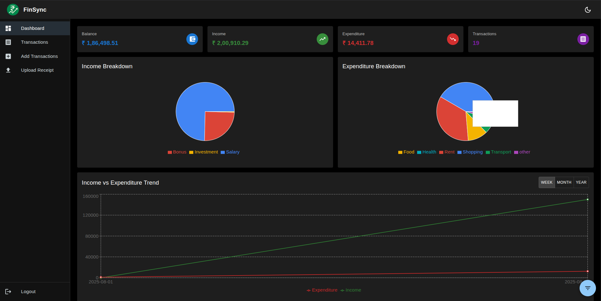
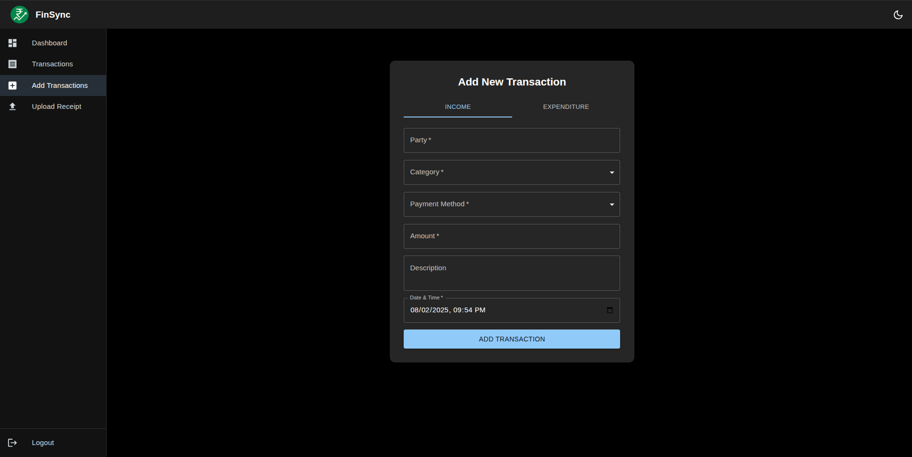
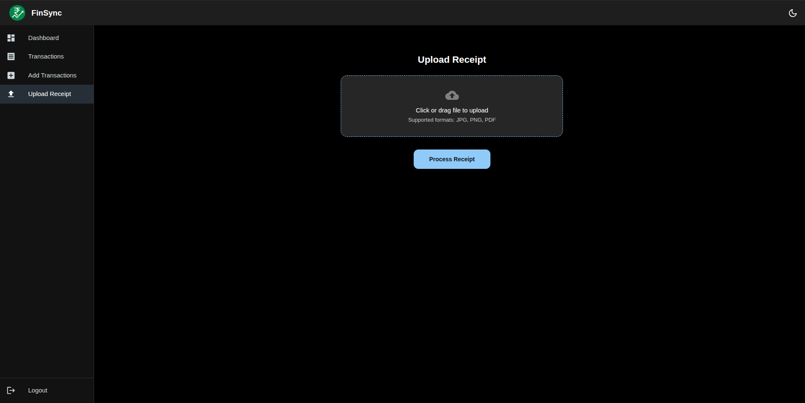
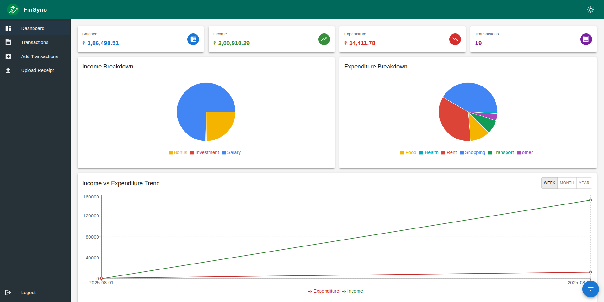
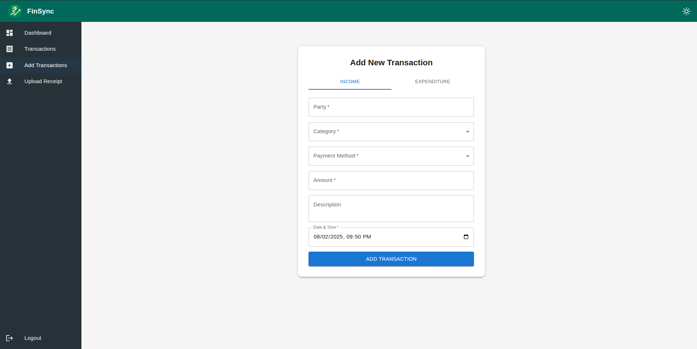
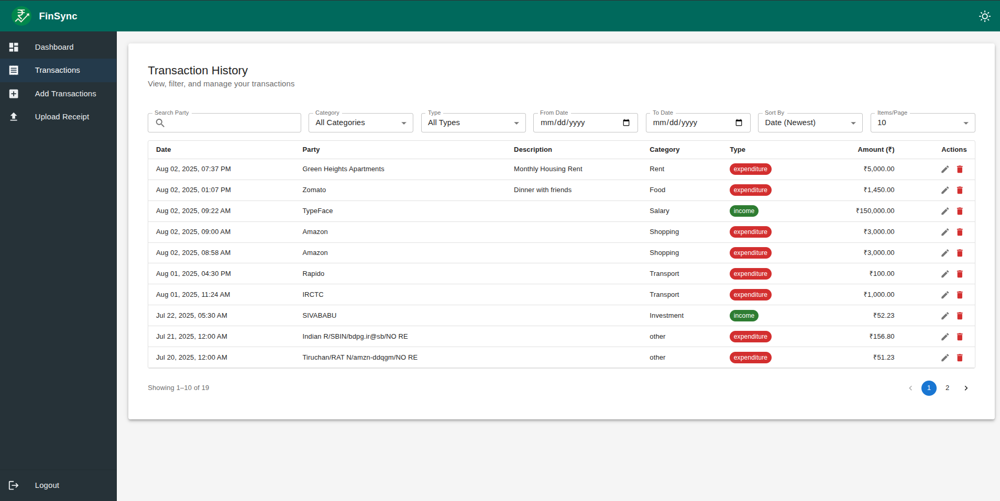
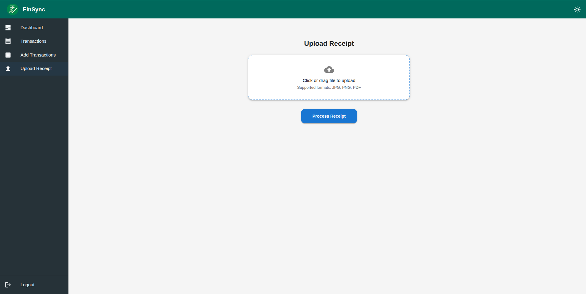

# 📊 FinSync Frontend

**FinSync** is a modern, responsive financial dashboard built using React and Vite. It provides an intuitive UI for managing transactions, visualizing insights, and tracking financial data efficiently.

---

## Demo Credentials

`email`: demo@finance.com  
`password`: demo1234

## ⚙️ Tech Stack

- ⚛️ React (with Hooks & Context)
- ⚡ Vite (lightning-fast development)
- 🎨 Material UI (MUI v5)
- 📊 Recharts (for graphs)
- 🌗 Dark/Light Theme Support
- 📡 Axios (for API requests)

---

## 🚀 Getting Started

### 1. Clone the Repository

```bash
git clone https://github.com/Ns-AnoNymouS/finsync-frontend.git
cd finsync-frontend
````

### 2. Install Dependencies

```bash
npm install
```

### 3. Configure Backend URL

Update the backend URL in the `.env` file:

```env
VITE_API_BASE_URL=http://localhost:5000
```

---

## 🧪 Run the App Locally

```bash
npm run dev
```

> The app will be available at: `http://localhost:8080`

---

## 📸 Screenshots

### 🌗 Dark Mode

| Login                             | Signup                             | Dashboard                             |
| --------------------------------- | ---------------------------------- | ------------------------------------- |
|  |  |  |

| Add Transaction                             | Transactions                             | Upload Receipt                             |
| ------------------------------------------- | ---------------------------------------- | ------------------------------------------ |
|  |  |  |

---

### ☀️ Light Mode

| Login                              | Signup                              | Dashboard                              |
| ---------------------------------- | ----------------------------------- | -------------------------------------- |
|  |  |  |

| Add Transaction                               | Transactions                              | Upload Receipt                              |
| --------------------------------------------- | ----------------------------------------- | ------------------------------------------- |
|  |  |  |

---

## 📁 Project Structure (Simplified)

```
├── public/
│   └── header.png
├── screenshots/
│   ├── *.png                 # All screenshot images used above
├── src/
│   ├── components/
│   ├── contexts/
│   ├── pages/
│   ├── services/
│   ├── App.jsx
│   └── main.jsx
└── .env
```

---

## 🪪 License

MIT License
